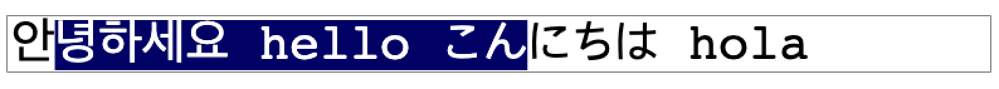

# Text canvas input improved



canvas based text input field improved.

## How to run

just run

```
npm run dev
```

deploy to github pages

```
npm deploy
```

## TODO

- text clip & viewport (텍스트내 보여줄 시작 위치)
- 최대글자 한글조합중일때 버그
- stop word space inclusion
- windows 플랫폼 이벤트 처리

## DONE

- left/right selection bug fix (선택방향)
- Alt + arrow subtle selection bug fix
- disable/enable
- 조합중인 한글 위치 버그
- 패스워드입력시 한글
- delete key 핸들링
- Shift + Alt 선택 후, 입력한상태로 이동시 선택해제되고 커서는 재자리로 돌아오도록 수정
- Alt + Shift 처음 이후 방향키입력시 고장남
- Alt + Shift 이후 Meta + Shift 입력시 고장남
- left Shift 이후 Meta + Shift 입력시 잘못 선택됨
- Alt + Shift 처음 이후 방향키입력시 고장남
- Shift + Home, Shift + End 구현
- getStopWordRange start/end 이슈
- getStopWordRange 특수문자 연속일 경우 처리
- 패스워드 인풋일경우, 방향키 선택 전부 없앨것
- onRight, onLeft Alt + Shift 선택 넘어가는 버그
- Delete + Alt 지우기 핸들링
- Alt 지우기 핸들링